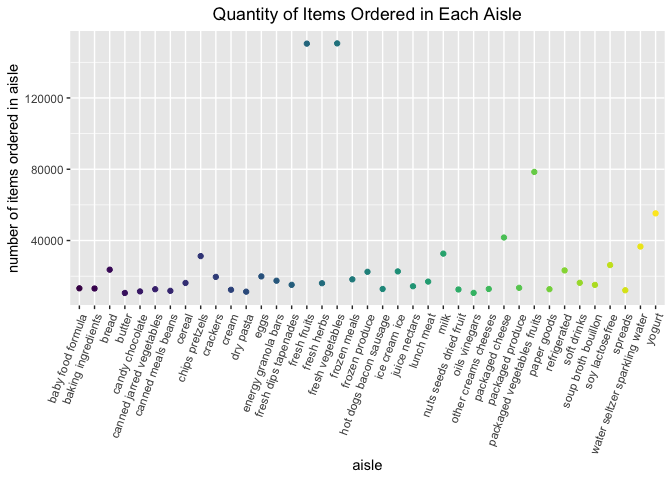

Homework 3
================
Connie Zhang
10/09/2019

# Problem 1

``` r
instacart = 
  library(p8105.datasets)
  data("instacart")
```

The instacart dataset has 1384617 observations, with 15 variables. Key
variables include order details, product name, aisle, and department
with respective numeric IDs associated with them. For example, this
dataset provides information on an order of bulgarian yogurt, what aisle
and department it can be found in (yogurt aisle 120, dairy egg
department), and how many days since the prior order.

  - Number of aisles and which aisles the most items are ordered from:

<!-- end list -->

``` r
instacart %>%
  count(aisle_id, name = "n") %>% 
arrange (desc(n))
```

    ## # A tibble: 134 x 2
    ##    aisle_id      n
    ##       <int>  <int>
    ##  1       83 150609
    ##  2       24 150473
    ##  3      123  78493
    ##  4      120  55240
    ##  5       21  41699
    ##  6      115  36617
    ##  7       84  32644
    ##  8      107  31269
    ##  9       91  26240
    ## 10      112  23635
    ## # … with 124 more rows

  - Plot that shows the number of items ordered in each aisle, limited
    to aisles with more than 10000 items ordered

<!-- end list -->

``` r
instacart %>%
  group_by(aisle) %>%
  summarize(aisle_n = n()) %>%
  filter(aisle_n >10000) %>%
  arrange (desc(aisle_n)) %>%
  ggplot(aes(x = aisle, y = aisle_n, color = aisle)) + ggtitle("Quantity of Items Ordered in Each Aisle") +
  theme(plot.title = element_text(hjust = 0.5))+ geom_point() + 
  labs(       x = "aisle",
              y = "number of items ordered in aisle")
```

<!-- -->

``` r
theme (axis.text.x = element_text(angle = 70, hjust = 1))
```

    ## List of 1
    ##  $ axis.text.x:List of 11
    ##   ..$ family       : NULL
    ##   ..$ face         : NULL
    ##   ..$ colour       : NULL
    ##   ..$ size         : NULL
    ##   ..$ hjust        : num 1
    ##   ..$ vjust        : NULL
    ##   ..$ angle        : num 70
    ##   ..$ lineheight   : NULL
    ##   ..$ margin       : NULL
    ##   ..$ debug        : NULL
    ##   ..$ inherit.blank: logi FALSE
    ##   ..- attr(*, "class")= chr [1:2] "element_text" "element"
    ##  - attr(*, "class")= chr [1:2] "theme" "gg"
    ##  - attr(*, "complete")= logi FALSE
    ##  - attr(*, "validate")= logi TRUE

  - Table that shows three most popular items in aisles “baking
    ingredients”, “dog food care”, and “packaged vegetables fruits”.
  - Include the number of times each item is ordered in your table.

<!-- end list -->

``` r
table_popular = 
instacart %>%
  filter(aisle %in% c("baking ingredients", "dog food care", "packaged vegetables fruits")) %>%
  group_by(aisle) %>%
  count(product_name, name = "product_count") %>%
  mutate(product_rank = min_rank(desc(product_count))) %>%
  filter(min_rank(product_rank) < 4) %>%
knitr::kable()
table_popular
```

| aisle                      | product\_name                                 | product\_count | product\_rank |
| :------------------------- | :-------------------------------------------- | -------------: | ------------: |
| baking ingredients         | Cane Sugar                                    |            336 |             3 |
| baking ingredients         | Light Brown Sugar                             |            499 |             1 |
| baking ingredients         | Pure Baking Soda                              |            387 |             2 |
| dog food care              | Organix Chicken & Brown Rice Recipe           |             28 |             2 |
| dog food care              | Small Dog Biscuits                            |             26 |             3 |
| dog food care              | Snack Sticks Chicken & Rice Recipe Dog Treats |             30 |             1 |
| packaged vegetables fruits | Organic Baby Spinach                          |           9784 |             1 |
| packaged vegetables fruits | Organic Blueberries                           |           4966 |             3 |
| packaged vegetables fruits | Organic Raspberries                           |           5546 |             2 |

  - Table that shows the mean hour of the day at which Pink Lady Apples
    and Coffee Ice Cream are ordered on each day of the week; format
    this table for human readers (i.e. produce a 2 x 7 table)

<!-- end list -->

``` r
table_icecream_apple = instacart %>%
  select(product_name, order_dow, order_hour_of_day) %>%
  group_by(product_name, order_dow) %>%
  summarize(mean_hour = mean(order_hour_of_day)) %>%
  mutate(order_dow = recode(order_dow, "0" = "Sunday", "1" = "Monday", "2" = "Tuesday", "3" = "Wednesday", "4" = "Thursday", "5" = "Friday", "6" = "Saturday")) %>%
  filter(product_name %in% c("Pink Lady Apples", "Coffee Ice Cream")) %>%
  pivot_wider(names_from = "order_dow", values_from = "mean_hour") %>%
knitr::kable(digits = 2)
table_icecream_apple
```

| product\_name    | Sunday | Monday | Tuesday | Wednesday | Thursday | Friday | Saturday |
| :--------------- | -----: | -----: | ------: | --------: | -------: | -----: | -------: |
| Coffee Ice Cream |  13.77 |  14.32 |   15.38 |     15.32 |    15.22 |  12.26 |    13.83 |
| Pink Lady Apples |  13.44 |  11.36 |   11.70 |     14.25 |    11.55 |  12.78 |    11.94 |
